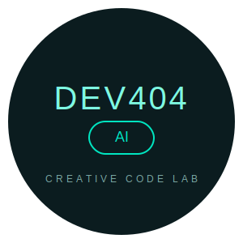

#  DEV404 AI

> A creative code lab bringing AI-powered projects to life.

---

## About

DEV404 AI is an innovative project that combines creativity with artificial intelligence to build cutting-edge applications.

## Features

- AI-powered solutions
- Creative coding experiments
- Modern web technologies
- Clean, efficient code

## Getting Started

```bash
# Clone the repository
git clone https://github.com/your-username/dev404.git

# Install dependencies
npm install

# Start development server
npm run dev
```

## Tech Stack

- **Frontend:** React, TypeScript
- **Styling:** CSS/Tailwind
- **AI:** Integration-ready for various AI services

---

<div align="center">

**Built with 💚 by DEV404 Creative Code Lab**

</div>